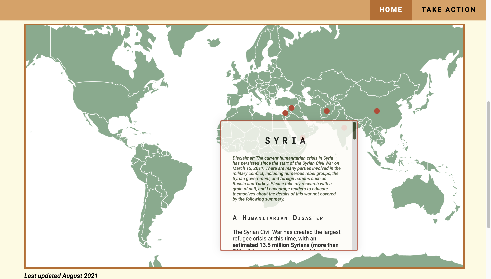
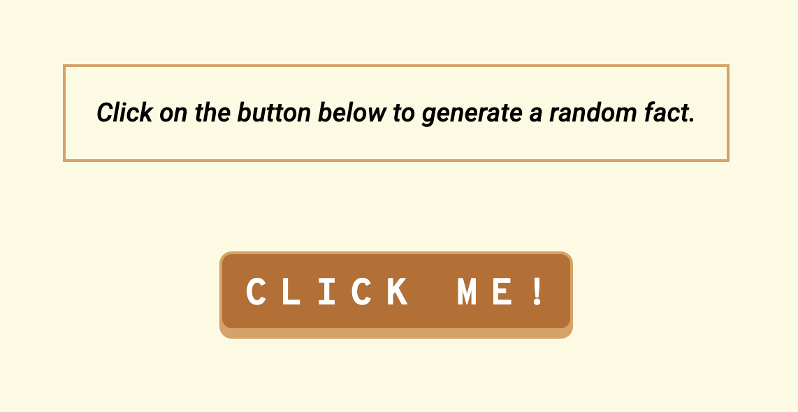
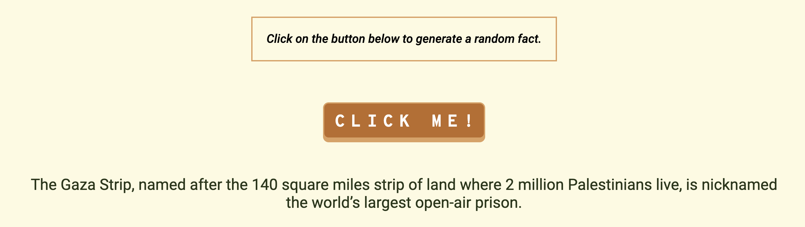

# HUMAPITARIAN 
## Table of Contents
- [HUMAPITARIAN](#humapitarian)
  - [Table of Contents](#table-of-contents)
  - [Description](#description)
  - [Motivation](#motivation)
  - [Technologies Used](#technologies-used)
  - [Vision](#vision)
  - [Challenges](#challenges)
    - [Map](#map)
  - [How To Use Project](#how-to-use-project)
  - [Credits](#credits)

## Description 
Humapitarian is a play on the word "humanitarian". It is an educational website where users can navigate an interactive map to learn about current humanitarian crises. 

When users hover over a red pulsing pin, that's been positioned over a country, a pop-up displays information about that nation's current humanitarian crises. Humapitarian is designed to give information in an easy-to-digest and concise format and **should be used in addition** to further research. 

## Motivation 
The summer of 2018, in the Girls Who Code Summer Immersion Program, my two teammates and I decided to develop a website about humanitarian crises for the final showcase. We dubbed it "Humapitarian" because we wanted to feature a map with all of our information in place. We ended up embedding a Google Map, a last resort to the countless map options we had researched and failed to understand. 

Fast forward to 2021, and I became a TA for the same summer program that had introduced me to computer science. Due to the virtual format, the students had one week to complete their own Activist Toolkit, a website about a cause they're passionate about. Teaching team members were encouraged to create their own Toolkits, so I decided to do a brand-new version of Humapitarian. 

## Technologies Used
This website was developed with HTML, CSS, and Javascript, and hosted on Github at [iramimorshed.github.io/humapitarian](https://iramimorshed.github.io/humapitarian/). I also used Figma beforehand to plan out the design of the website such as colors, layout, fonts, etc. 

## Vision 
Right now, the website is still very much a work in progress, with only several countries having adequate information and the "Take Action" page remains incomplete. However, I hope to slowly but surely add more pins since unfortunately many nations around the world are and have been experiencing humanitarian crises. I also want to create a comprehensive "Take Action" page, which will feature potential petitions to sign, donation sites, and other resources to learn more. 

## Challenges
### Map
The biggest challenge was the map itself. When I worked on the first version of Humapitarian, I spent most of my time researching for each nation and also researching how to include a map onto the website. Google Maps was a last-minute, safe option. 

This time, I wanted to find a better alternative. I tried everything from image maps, then image maps with jQuery tooltips, then researching Bootstrap, to finally settling on adding tooltips to a world map. A tooltip is a brief message that appears when a user engages with an element. 

## How To Use Project
Navigate to https://iramimorshed.github.io/humapitarian/. The home page features a description and the actual map. When mousing over a red pulsing pin, a tooltip should appear. 

Below that is a fact generator. When the button is clicked, a random fact is displayed. 

*Before Click*

*After Click*

## Credits
For the tooltips, I used this tutorial as a guide: https://www.youtube.com/watch?v=e_jEquJo7y8&t=2424s&ab_channel=WEBCIFAR

I did omit some things such as responsiveness and customizing the tooltips to my own style. For the pulsing pins, I drew inspiration from the tutorial above, but primarily followed this website: https://www.florin-pop.com/blog/2019/03/css-pulse-effect/

I also want to credit my two teammates, Kellie Chan and Samantha Wang, who I worked with to create the first version of Humapitarian in 2018 (*Link given upon request*). 

